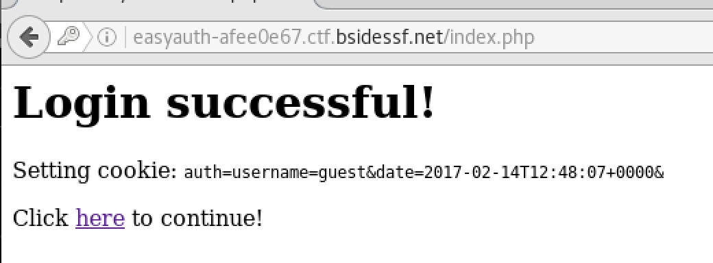
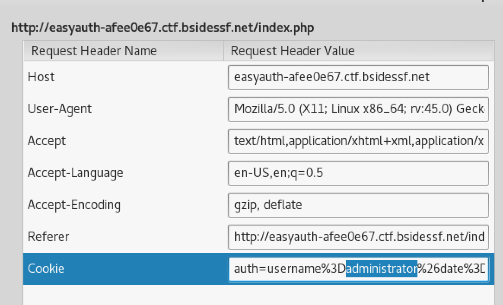

#easyauth / web 30
```
Can you gain admin access to this site?

http://easyauth-afee0e67.ctf.bsidessf.net

* easyauth.php
```


We have auth page with user and password form

If we login as guest/guest this will display our cookies:

and if I click to link, then we can see what I don't have admin rights

In the [easyauth.php](./easyauth.php) there is a check for administrator username:
```php
print "<h1>Welcome back, $username!</h1>\n";
if($username == 'administrator') {
  print "<p>Congratulations, you're the administrator! Here's your reward:</p>\n";
  print "<p>" . FLAG . "</p>\n";
} else {
  print "<p>It's cool that you logged in, but unfortunately we can only give the flag to 'administrator'. :(</p>\n";
}
```
The solution is simple, just change cookie value 'guest' to 'administrator'.
I use Tamper Data in firefox to change request

```
Welcome back, administrator!

Congratulations, you're the administrator! Here's your reward:

FLAG:0076ecde2daae415d7e5ccc7db909e7e

Log out
```
