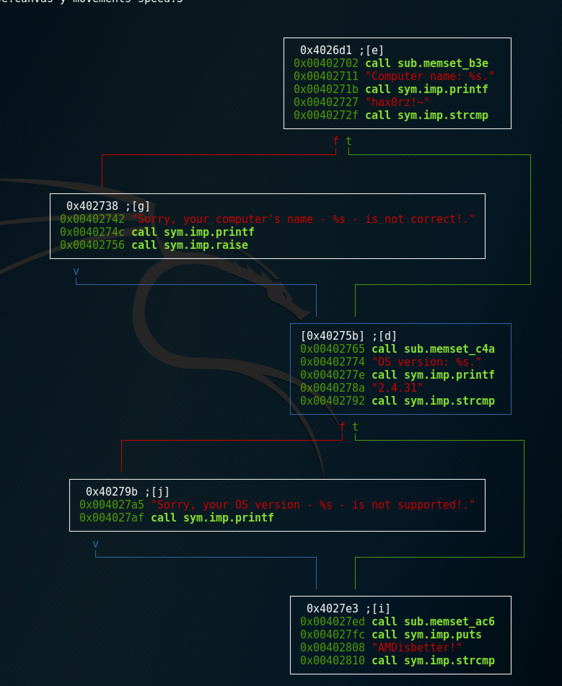

#Skipper / RE 75
```
The given binary will give you the password... if you meet its criteria!


* skipper-32
* skipper-64

```

We have 32 and 64-bit ELF files
```
→ file skipper-64
skipper-64: ELF 64-bit LSB executable, x86-64, version 1 (SYSV), dynamically linked, interpreter /lib64/ld-linux-x86-64.so.2, for GNU/Linux 2.6.32, BuildID[sha1]=39f82b8f626894e67276729dc655041eb7f16eb4, stripped
```
```
$ ./skipper-64
Computer name: bad
Sorry, your computer's name - bad - is not correct!
Killed
```
Open it in radare2
```
$ r2 ./skipper-64 -A

[0x004009d0]> s main
[0x004026d1]> VV
```
And we can see graphs, that check for username, OS version and CPU:

I changed je instructions to jmp
```
[0x00402742]> oo+
File ./skipper-64 reopened in read-write mode
[0x00402742]> s 0x00402736
[0x00402736]> pD 15
│       ┌─< 0x00402736      7423           je 0x40275b
│       │   0x00402738      488d85f0fbff.  lea rax, qword [rbp - local_410h]
│       │   0x0040273f      4889c6         mov rsi, rax
│       │   0x00402742      bf             invalid
│       │   0x00402743      a829           test al, 0x29               ; ')' ; ')'
[0x00402736]> wx eb
[0x00402736]> pD 15
│       ┌─< 0x00402736      eb23           jmp 0x40275b
│       │   0x00402738      488d85f0fbff.  lea rax, qword [rbp - local_410h]
│       │   0x0040273f      4889c6         mov rsi, rax
│       │   0x00402742      bf             invalid
│       │   0x00402743      a829           test al, 0x29               ; ')' ; ')'
[0x00402736]> s 0x00402799
[0x00402799]> wx eb
[0x00402799]> pd
[0x00402799]> s 0x00402817
[0x00402817]> wx eb
[0x00402817]> q
$ ./skipper-64
Computer name: bad
OS version: 4.8.0
GenuineIntel
Result: FLAG:f51579e9ca38ba87d71539a9992887ff
```

>FLAG:f51579e9ca38ba87d71539a9992887ff